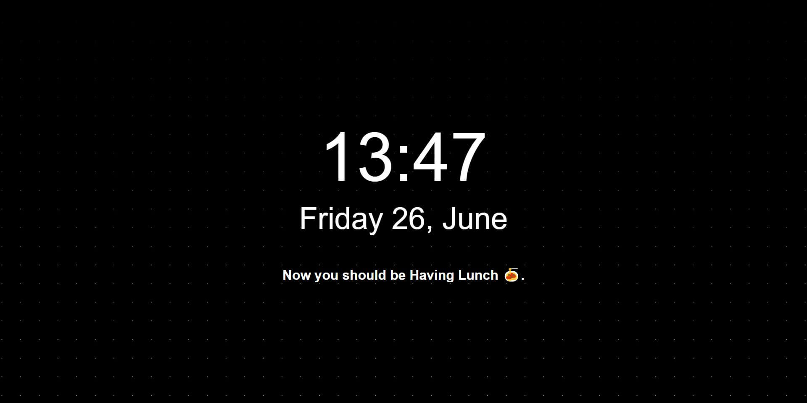

<h2 align="center"> newtab </h2>

  
   
  

**minimal newtab:** without ads or "Paid" features or tracking.
Built with Next.js and Tailwind.

## Features

- showcase current local time and week ✅
- minimal no signups or any other stuff or pro thing ✅
- showcase your next calendar events for the current day ✅

To-do List:

- reduce battery usage and re-renders when not in focus
- provide keyboard shortcuts
